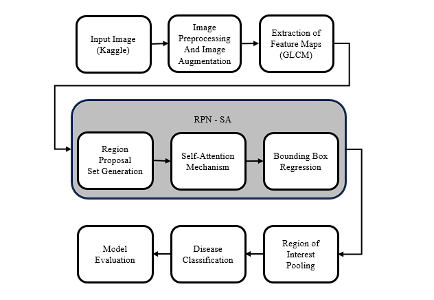
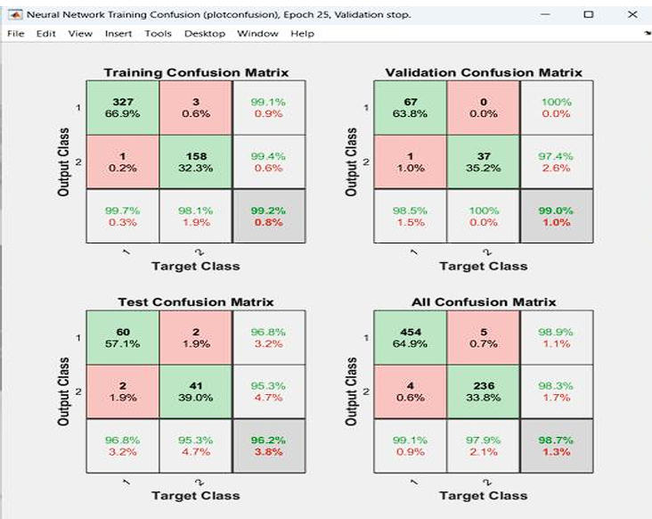
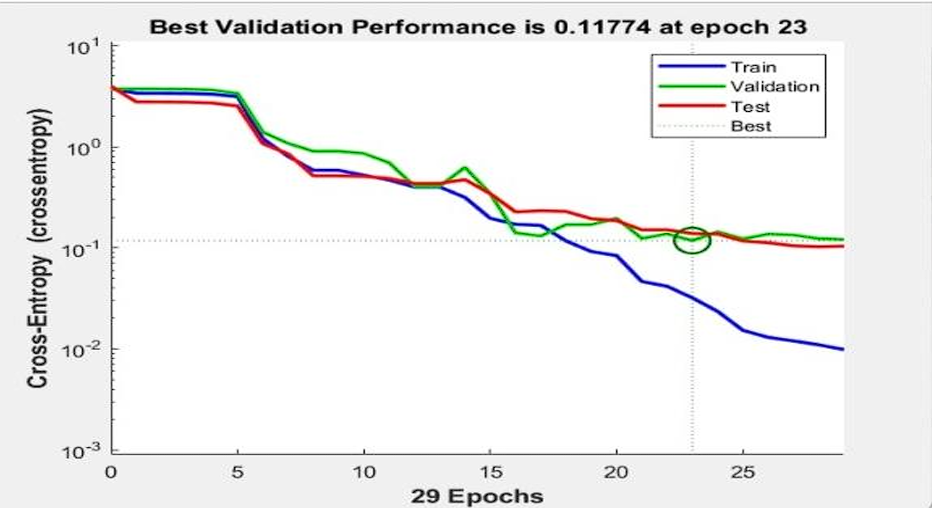
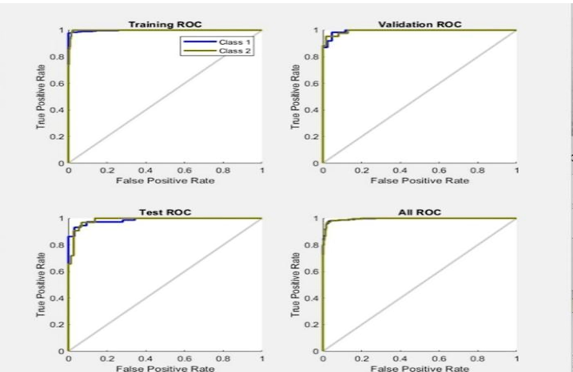

# Automated Early Detection of Plant Diseases using Optimized Deep Learning Techniques

A deep learning-based plant disease detection system designed for early identification of infected regions in plant leaf images. The approach combines GLCM-based texture feature extraction with a Region Proposal Network enhanced by Self-Attention (RPN-SA) to focus on disease-affected regions and improve classification performance.

This work was presented at the 4th International Conference on Deep Sciences for Computing and Communications (ICONDEEPCOM 2025).

---

## Overview

Plant diseases can significantly affect agricultural productivity, making early and accurate detection important for timely intervention.

This work proposes an optimized deep learning framework that focuses on identifying disease-affected regions within plant leaf images rather than relying only on the complete image.

The proposed pipeline combines:

- Image preprocessing and augmentation
- GLCM-based texture feature extraction
- Region Proposal Network (RPN)
- Self-Attention mechanism
- Bounding box regression
- Region of Interest (ROI) pooling
- SVM-based disease classification

---

## Proposed Method

The overall processing pipeline follows:

```text
Input Leaf Image
       │
       ▼
Image Preprocessing
       │
       ▼
Image Augmentation
       │
       ▼
GLCM Feature Extraction
       │
       ▼
Region Proposal Network
       │
       ▼
Self-Attention
       │
       ▼
Bounding Box Regression
       │
       ▼
ROI Pooling
       │
       ▼
SVM Classification
       │
       ▼
Disease / Healthy Prediction
```

---

## Architecture

The proposed architecture combines texture-based feature extraction with region-based deep learning.

### RPN-SA Architecture



The Region Proposal Network generates candidate regions from extracted feature maps, while the Self-Attention mechanism helps prioritize visually important disease-related regions.

---

## Methodology

### 1. Image Preprocessing and Augmentation

The input images are preprocessed before feature extraction and model training.

The preprocessing pipeline includes:

- Image resizing
- Pixel normalization
- Image augmentation
- Rotation
- Image shifting
- Horizontal flipping

These operations increase image variation and support model generalization.

### 2. GLCM Feature Extraction

The Gray-Level Co-occurrence Matrix (GLCM) is used to extract texture information from plant leaf images.

The extracted texture characteristics represent disease-related visual patterns such as:

- Contrast
- Correlation
- Homogeneity
- Texture variations
- Surface patterns

### 3. Region Proposal Network with Self-Attention

The Region Proposal Network (RPN) generates candidate regions that may contain disease symptoms.

A Self-Attention mechanism is incorporated to emphasize informative regions and reduce the influence of irrelevant background areas.

### 4. Bounding Box Regression

Bounding box regression is used to refine the coordinates of proposed disease regions.

This improves the localization of disease-affected areas and helps reduce unnecessary background information.

### 5. ROI Pooling

Region of Interest (ROI) pooling converts variable-sized proposed regions into fixed-size feature representations.

The resulting representations are passed to the final classification stage.

### 6. Classification

An SVM classifier is used for the final classification stage.

The classifier distinguishes between:

- Diseased leaf
- Healthy leaf

---

## Results

The experimental evaluation includes:

- Confusion matrix analysis
- Validation performance analysis
- ROC curve analysis

### Confusion Matrix



The confusion matrices show classification performance across the training, validation, testing, and complete datasets.

### Validation Performance



The validation performance graph shows the cross-entropy loss across training epochs.

The best reported validation performance was approximately **0.11774 at epoch 23**.

### ROC Curve



ROC analysis was performed across the training, validation, and testing stages.

The curves demonstrate strong discrimination between the diseased and healthy classes.

---

## Performance

| Metric | Result |
|---|---:|
| Overall Accuracy | 98.7% |
| Test Class 1 Accuracy | 96.8% |
| Test Class 2 Accuracy | 95.3% |
| Best Validation Loss | 0.11774 |
| Best Validation Epoch | 23 |

---

## Presentation

The work was presented at the **4th International Conference on Deep Sciences for Computing and Communications (ICONDEEPCOM 2025)**.

**Paper ID:** 130

The presentation contains the project motivation, methodology, architecture, experimental evaluation, results, and references.

```text
presentation/ICONDEEPCOM_2025_Presentation.pptx
```

---

## Repository Contents

```text
automated-plant-disease-detection-rpn-sa/
│
├── README.md
│
├── presentation/
│   └── ICONDEEPCOM_2025_Presentation.pptx
│
└── images/
    ├── architecture/
    │   └── rpn_sa_architecture.png
    │
    └── results/
        ├── confusion_matrix.png
        ├── validation_loss.png
        └── roc_curve.png
```

---

## Technologies and Methods

- Python
- TensorFlow / Keras
- Deep Learning
- Computer Vision
- Image Processing
- GLCM
- Region Proposal Network (RPN)
- Self-Attention
- ROI Pooling
- SVM

---

## Research Focus

- Automated plant disease detection
- Early disease identification
- Disease-region localization
- Texture feature extraction
- Attention-based feature processing
- Deep learning for smart agriculture
- Computer vision for agricultural applications

---

## Authors

**Dr. G. Kavitha**  
**Dr. P. Latchoumy**  
**Noorul Hassan M.U.**

Department of Information Technology  
B.S. Abdur Rahman Crescent Institute of Science and Technology  
Chennai, India

---

## Conference

**4th International Conference on Deep Sciences for Computing and Communications (ICONDEEPCOM 2025)**

**Paper ID:** 130

**Project Title:**  
*Automated Early Detection of Plant Diseases using Optimized Deep Learning Techniques*

---

## Note

This repository contains selected presentation materials and project visuals associated with the work.

The repository provides an overview of the proposed methodology, architecture, and reported experimental results.

---

## License

No license is currently granted for reuse, modification, or redistribution of the repository contents.

For academic or research-related use of the materials, please contact the authors.
